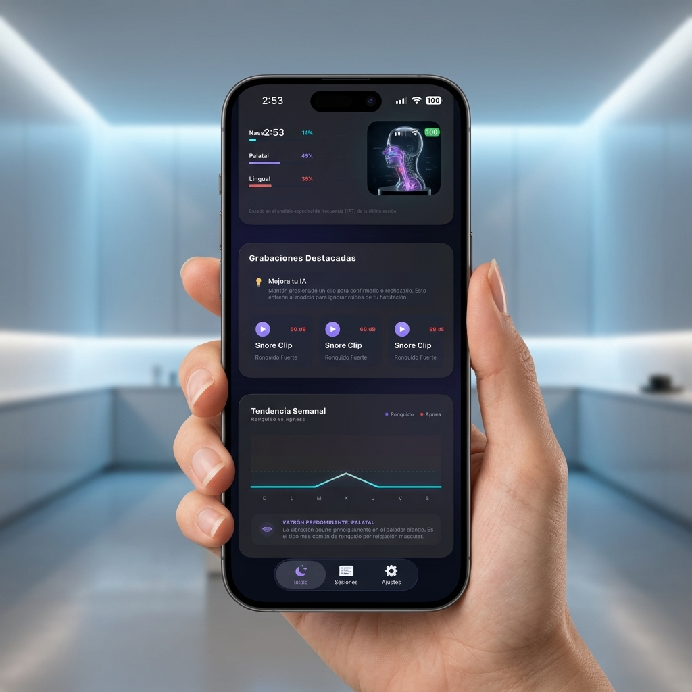
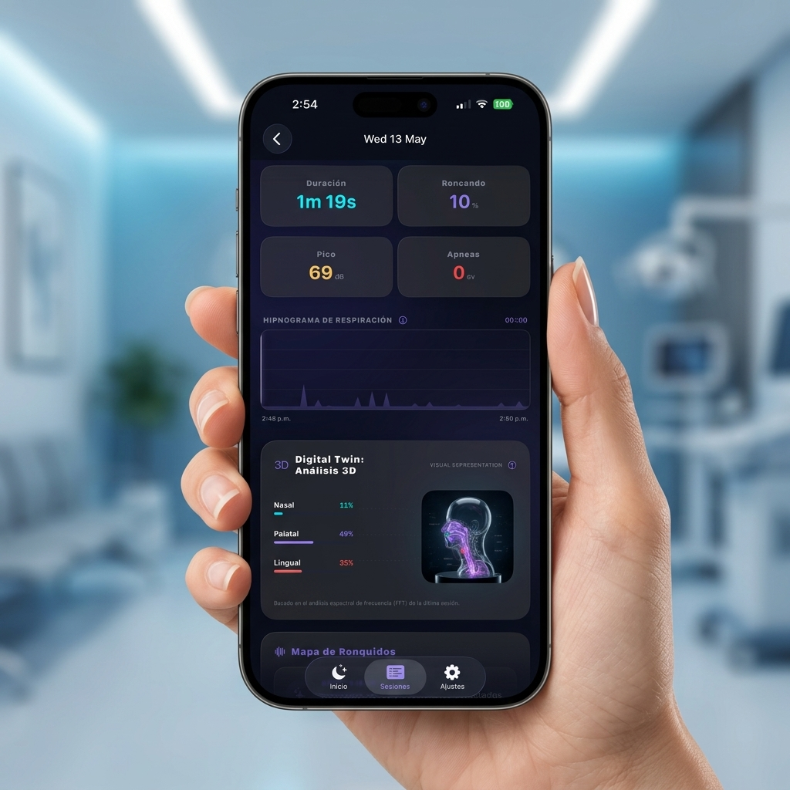

# 🎙️ Somnera — State-of-the-Art Sleep Diagnostics

[](https://github.com/Alucardo18/Somnera)
[](https://developer.apple.com/ios/)
[](LICENSE)

Somnera es la cumbre de la tecnología de monitoreo de sueño en iOS. Diseñada para transformar el iPhone en un laboratorio de diagnóstico clínico personal, Somnera utiliza **fusión sensorial avanzada** y **aprendizaje profundo** para detectar ronquidos y apnea del sueño con una precisión sin precedentes, manteniendo la privacidad absoluta mediante un procesamiento 100% local (Edge AI).




## 🌌 Tecnología de Vanguardia

Somnera integra un stack tecnológico de nivel industrial para ofrecer resultados precisos y confiables:

### 🧠 Sentinel V2: El Motor de Fusión Sensorial
A diferencia de las aplicaciones convencionales que dependen únicamente del audio, nuestro motor **Sentinel V2** utiliza una validación cruzada avanzada:
- **Acoustic Energy Analysis**: Monitoreo en tiempo real de la energía RMS y filtrado de ruidos constantes (Fans/AC) mediante **Crest Factor Analysis**.
- **Actigrafía de Alta Frecuencia**: Integración con **CoreMotion** (10Hz) para validar la inmovilidad física durante episodios de apnea.
- **Recovery Gasp Detection**: Identificación de picos de energía post-apnea mediante modelos neuronales.

### 🔬 Procesamiento de Señal y AI Local
- **Core ML & SoundAnalysis**: Modelo de red neuronal convolucional optimizado para el Apple Neural Engine.
- **Digital Twin 3D**: Reconstrucción anatómica de la vía aérea que identifica obstrucciones **Nasales, Palatales o Linguales**.
- **PSG Medical Timeline**: Visualización de grado médico con resolución de 1s y escala estandarizada de 0-90 dB.



### 💎 Diseño Premium & UX
- **Glassmorphism Hub**: Una interfaz inmersiva basada en materiales ultra-delgados y el concepto de "Sleep Galaxy" para navegar por tus sesiones.
- **HealthKit Synergy**: Sincronización bidireccional con Apple Health.


## 🛠️ Stack Tecnológico

- **Core**: Swift 5.9 + SwiftUI (MVVM Architecture).
- **IA**: Core ML, SoundAnalysis, Neural Engine.
- **Hardware**: Accelerometer, AVAudioEngine (Low latency).
- **Health**: HealthKit.
- **Storage**: SwiftData.

## 🚀 Instalación y Desarrollo

Este proyecto utiliza **XcodeGen** para una gestión de proyecto limpia y determinista.

```bash
# 1. Instalar XcodeGen
brew install xcodegen

# 2. Generar el proyecto
xcodegen generate

# 3. Abrir en Xcode
open Somnera.xcodeproj
```

## ⚖️ Licencia

Este proyecto está bajo la **Licencia MIT**. Ver el archivo [LICENSE](LICENSE) para más detalles.

---
Desarrollado con ❤️ y tecnología de punta por **Emmanuel Gonzalez**
