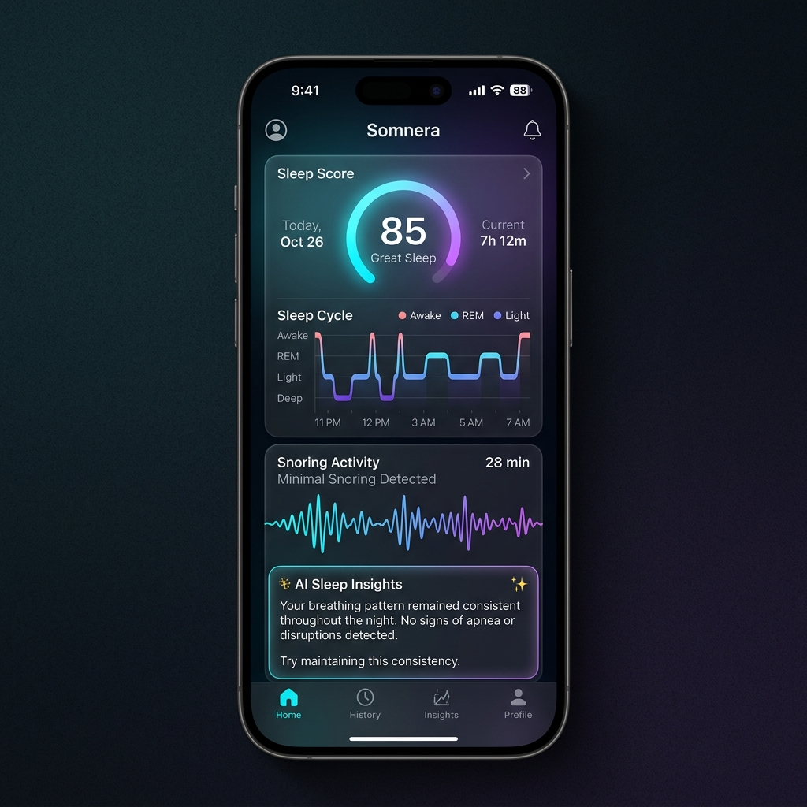

# 🎙️ Somnera — Professional Sleep Diagnostics

[](https://github.com/Alucardo18/Somnera)
[](https://developer.apple.com/ios/)
[](LICENSE)

Somnera es una plataforma de diagnóstico de sueño de alta precisión para iOS que transforma tu iPhone en un monitor de apnea y ronquidos de grado médico, priorizando la privacidad mediante el procesamiento 100% local.



## 🧠 Inteligencia Artificial y Machine Learning

Somnera no solo registra audio; lo interpreta. El núcleo de la aplicación utiliza una arquitectura de IA multinivel:

### 1. Clasificación de Sonido en Tiempo Real (CoreML)
Utilizamos el framework **SoundAnalysis** de Apple junto con un modelo **CoreML** personalizado (`SomneraClassifier`) entrenado para identificar patrones acústicos de ronquidos y jadeos de recuperación.
- **Procesamiento**: El audio se convierte a 16kHz y se analiza en ventanas de 1 segundo para garantizar una latencia mínima.
- **Local**: Todo el análisis ocurre en el Neural Engine del iPhone, sin enviar datos a la nube.

### 2. Sentinel V2: Fusión Sensorial (Local AI)
Nuestro algoritmo propietario **Sentinel V2** elimina los falsos positivos mediante la correlación cruzada de datos. A diferencia de otras apps que solo miden el silencio, Sentinel V2 valida una apnea solo si se cumplen tres condiciones:
- 🔇 **Silencio Acústico**: Caída repentina de la energía RMS por debajo de los 38dB.
- 🧘 **Inmovilidad Actigráfica**: Datos del acelerómetro (**CoreMotion**) confirmando la falta de movimiento físico durante el episodio.
- ⚡ **Jadeo de Recuperación**: Detección de un pico de energía post-silencio validado por Machine Learning.

### 3. Diagnostic Insights (Local LLM Logic)
Al finalizar cada sesión, nuestro motor de **SessionAnalytics** genera un reporte humano. No mostramos solo números; interpretamos la severidad (Leve, Moderada, Severa) y proporcionamos sugerencias accionables basadas en la tendencia de la noche.


## 🛠️ Stack Tecnológico

- **UI**: SwiftUI (Arquitectura MVVM + Glassmorphism Design).
- **Audio**: AVAudioEngine con procesamiento DSP avanzado (vDSP).
- **Sensores**: CoreMotion para actigrafía de alta frecuencia (10Hz).
- **Salud**: Integración total con **HealthKit** para sincronizar sesiones de sueño.
- **Gestión**: XcodeGen para un control de proyecto reproducible y limpio.

## 🚀 Instalación y Desarrollo

Este proyecto utiliza **XcodeGen** para gestionar el archivo `.xcodeproj`.

```bash
# 1. Instalar XcodeGen
brew install xcodegen

# 2. Generar el proyecto
xcodegen generate

# 3. Abrir en Xcode
open Somnera.xcodeproj
```

## ⚖️ Licencia

Este proyecto está bajo la **Licencia MIT**. Ver el archivo [LICENSE](LICENSE) para más detalles.

---
Desarrollado con ❤️ por **Emmanuel Gonzalez**
